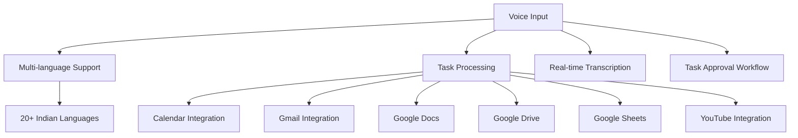
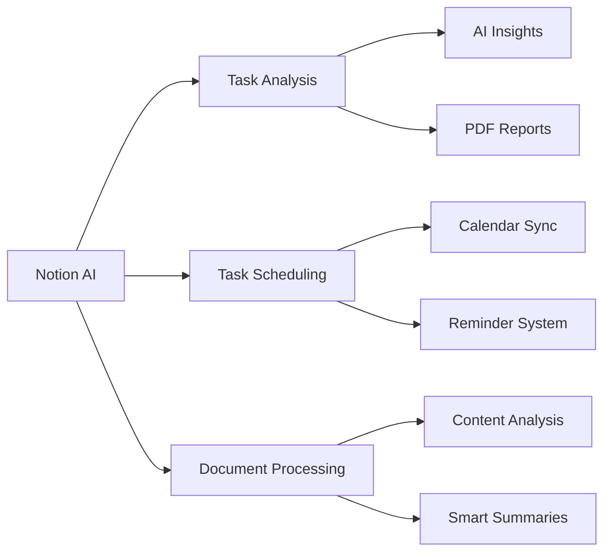
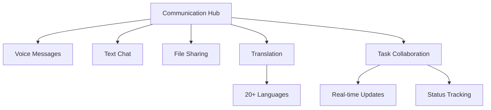
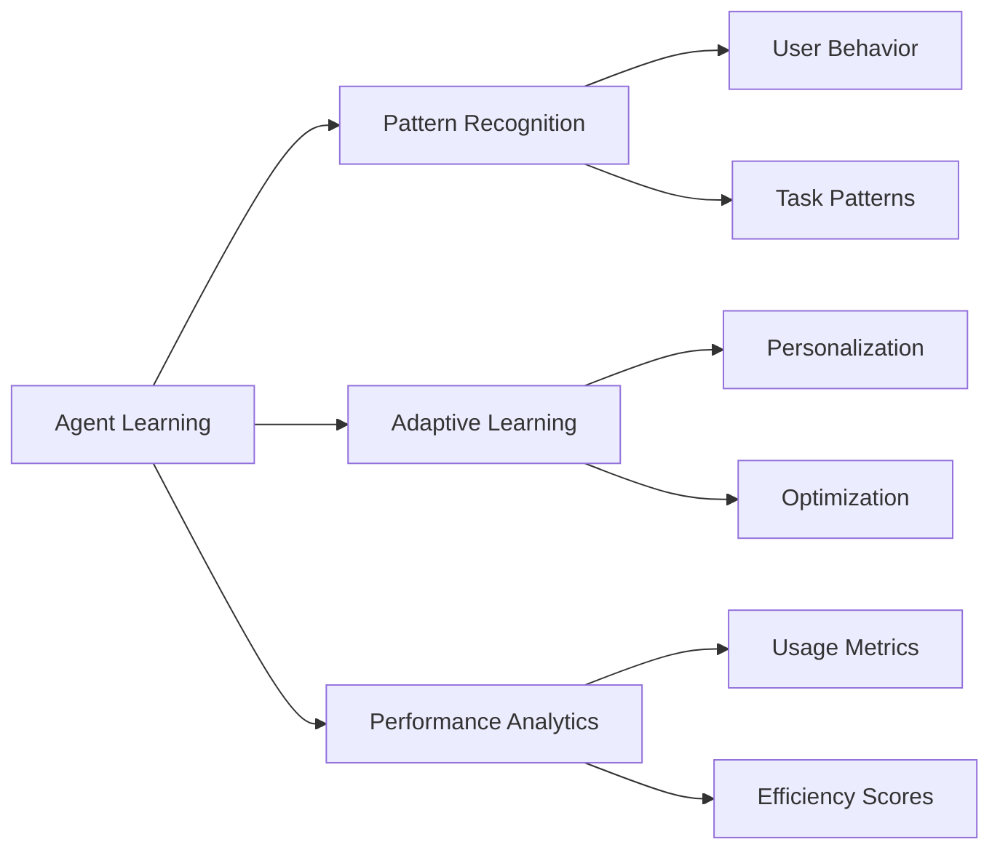
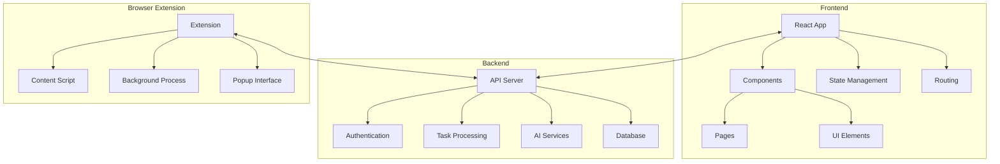

# 🚀Giga Brain - AI-Powered Productivity Suite


<div align="center">


[](https://reactjs.org/)
[](https://vitejs.dev/)
[](https://tailwindcss.com/)
[](https://www.typescriptlang.org/)

</div>

## 📑 Table of Contents
- [Overview](#-overview)
- [Features](#-features)
- [Architecture](#-architecture)
- [Getting Started](#-getting-started)
- [Installation](#-installation)
- [Usage](#-usage)
- [API Documentation](#-api-documentation)
- [Contributing](#-contributing)
- [License](#-license)

## 🌟 Overview

TCET Unofficial is a cutting-edge productivity suite that combines AI, voice recognition, and seamless integration with popular tools to enhance your workflow. Built with modern technologies and a focus on user experience, this platform offers a comprehensive solution for task management, communication, and AI-powered assistance.

## 🎯 Features

### 1. Voice Input System


### 2. Notion AI Integration


### 3. Communication System


### 4. Agent Learning System


## 🏗 Architecture



## 🚀 Getting Started

### Prerequisites
- Node.js (v18 or higher)
- npm or yarn
- Python 3.8+ (for backend services)
- Git
- Virtual Environment (Python)
- Chrome/Edge browser (for extension)

### Project Structure
```
tcet-unofficial/
├── client/                 # Frontend React application
├── notion/                # Notion AI integration backend
├── rl_agent/             # Reinforcement Learning agent
├── extension/            # Browser extension
└── scripts/              # Utility scripts
```

### Detailed Setup Instructions

1. **Clone and Setup Base Project**
```bash
git clone https://github.com/yourusername/tcet-unofficial.git
cd tcet-unofficial
```

2. **Frontend Setup (React + Vite)**
```bash
cd client
npm install
# Create .env file
echo "VITE_API_URL=http://localhost:5000" > .env
npm run dev  # Runs on http://localhost:5173
```

3. **Notion AI Backend Setup**
```bash
cd notion
python -m venv venv
source venv/bin/activate  # On Windows: .\venv\Scripts\activate
pip install -r requirements.txt
# Create .env file
echo "NOTION_API_KEY=your_key_here
FLASK_APP=notion.py
FLASK_ENV=development" > .env
flask run  # Runs on http://localhost:5000
```

4. **RL Agent Setup**
```bash
cd rl_agent
python -m venv venv
source venv/bin/activate  # On Windows: .\venv\Scripts\activate
pip install -r requirements.txt
# Create .env file
echo "MODEL_PATH=./dqn_model.pth
API_URL=http://localhost:5000" > .env
python integration.py  # Runs on http://localhost:5001
```

5. **Browser Extension Setup**
```bash
cd extension
# Load unpacked extension in Chrome/Edge:
# 1. Open chrome://extensions/
# 2. Enable Developer mode
# 3. Click "Load unpacked"
# 4. Select the extension folder
```

### Quick Start Script

We provide a shell script to start all services at once. Create a file named `start.sh` in the root directory:

```bash
#!/bin/bash

# Function to check if a port is in use
check_port() {
    if lsof -Pi :$1 -sTCP:LISTEN -t >/dev/null ; then
        return 0
    else
        return 1
    fi
}

# Function to start a service
start_service() {
    local name=$1
    local command=$2
    local port=$3
    
    echo "Starting $name..."
    if check_port $port; then
        echo "Port $port is already in use. Skipping $name."
    else
        $command &
        echo "$name started on port $port"
    fi
}

# Create virtual environments if they don't exist
if [ ! -d "notion/venv" ]; then
    echo "Setting up Notion backend virtual environment..."
    cd notion
    python -m venv venv
    source venv/bin/activate
    pip install -r requirements.txt
    cd ..
fi

if [ ! -d "rl_agent/venv" ]; then
    echo "Setting up RL Agent virtual environment..."
    cd rl_agent
    python -m venv venv
    source venv/bin/activate
    pip install -r requirements.txt
    cd ..
fi

# Start all services
start_service "Frontend" "cd client && npm run dev" 5173
start_service "Notion Backend" "cd notion && source venv/bin/activate && flask run" 5000
start_service "RL Agent" "cd rl_agent && source venv/bin/activate && python integration.py" 5001

echo "All services started! Access the application at http://localhost:5173"
```

For Windows users, create `start.bat`:

```batch
@echo off

:: Function to check if a port is in use
:check_port
netstat -an | find ":%1" | find "LISTENING" >nul
if errorlevel 1 (
    exit /b 1
) else (
    exit /b 0
)

:: Start Frontend
start cmd /k "cd client && npm run dev"

:: Start Notion Backend
start cmd /k "cd notion && .\venv\Scripts\activate && flask run"

:: Start RL Agent
start cmd /k "cd rl_agent && .\venv\Scripts\activate && python integration.py"

echo All services started! Access the application at http://localhost:5173
```

### Running the Services

1. **Using the Script (Recommended)**
```bash
# On Linux/Mac
chmod +x start.sh
./start.sh

# On Windows
start.bat
```

2. **Manual Start**
```bash
# Terminal 1 - Frontend
cd client
npm run dev

# Terminal 2 - Notion Backend
cd notion
source venv/bin/activate  # On Windows: .\venv\Scripts\activate
flask run

# Terminal 3 - RL Agent
cd rl_agent
source venv/bin/activate  # On Windows: .\venv\Scripts\activate
python integration.py
```

### Service Ports
- Frontend: http://localhost:5173
- Notion Backend: http://localhost:5000
- RL Agent: http://localhost:5001
- Browser Extension: Loaded in Chrome/Edge

### Environment Variables

1. **Frontend (.env in client/)**
```
VITE_API_URL=http://localhost:5000
```

2. **Notion Backend (.env in notion/)**
```
NOTION_API_KEY=your_key_here
FLASK_APP=notion.py
FLASK_ENV=development
```

3. **RL Agent (.env in rl_agent/)**
```
MODEL_PATH=./dqn_model.pth
API_URL=http://localhost:5000
```

## 📚 API Documentation

### Authentication Endpoints
```typescript
POST /api/auth/login
POST /api/auth/signup
POST /api/auth/logout
GET /api/auth/me
```

### Task Management
```typescript
GET /api/tasks
POST /api/tasks
PUT /api/tasks/:id
DELETE /api/tasks/:id
```

### Voice Processing
```typescript
POST /api/voice/transcribe
POST /api/voice/process
GET /api/voice/languages
```

### Notion Integration
```typescript
POST /api/notion/analyze
GET /api/notion/sync
POST /api/notion/tasks
```

## 🤝 Contributing

We welcome contributions! Please see our [Contributing Guidelines](CONTRIBUTING.md) for details.

1. Fork the repository
2. Create your feature branch (`git checkout -b feature/AmazingFeature`)
3. Commit your changes (`git commit -m 'Add some AmazingFeature'`)
4. Push to the branch (`git push origin feature/AmazingFeature`)
5. Open a Pull Request

## 📝 License

This project is licensed under the MIT License - see the [LICENSE](LICENSE) file for details.

## 🙏 Acknowledgments

- [React](https://reactjs.org/)
- [Vite](https://vitejs.dev/)
- [TailwindCSS](https://tailwindcss.com/)
- [Notion API](https://developers.notion.com/)
- [Google Cloud Speech-to-Text](https://cloud.google.com/speech-to-text)
- [Framer Motion](https://www.framer.com/motion/)

---

<div align="center">
Made with ❤️ by TCET Unofficial Team
</div>
